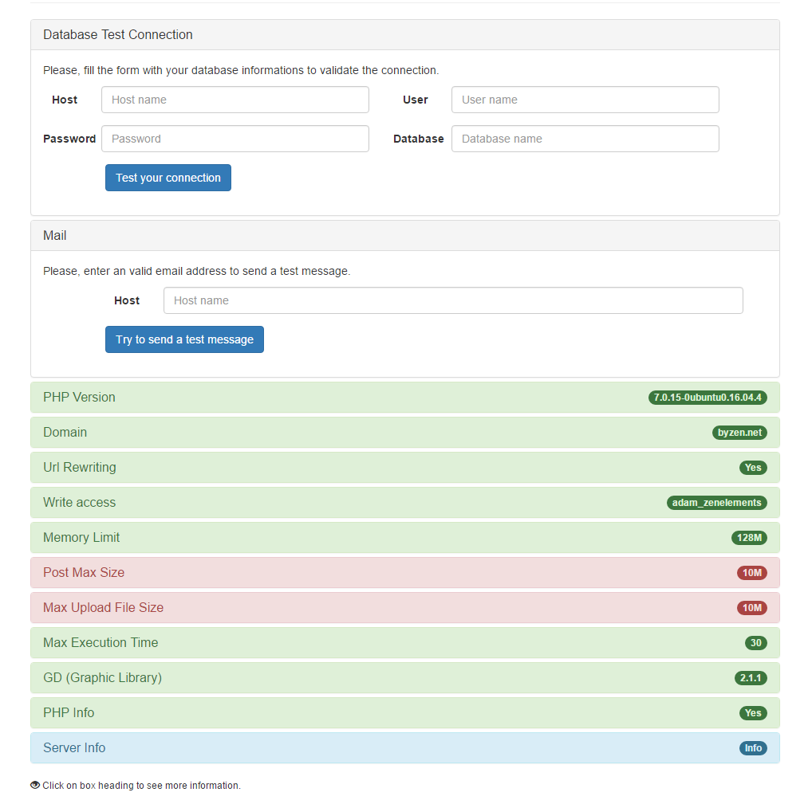

# HostZen

> Test your hosting for specific requirements for a zenelements project.

To test if your hosting is compatible with zenelements requirements, this script runs some checks for you.

## Getting started

* To use it, you need to **download**,
* place the file in your **web root folder**.
* and **access your site** using your configured domain.

[Direct download](https://raw.githubusercontent.com/zenelements/hosting-for-zen/master/hostzen.php).

## Test results

The script tests the following settings (and some others) :

* The PHP version
* Some PHP parameters like : `max_execution_time`, `memory_limit`.
* The domain configuration : is your site accessible using your domain.
* The write access on directories and files for the web user.
* The database access _(you must enter the connection parameters, manually)_.
* If the server can send email.

When the tests are done, you'll see a result page like this.



The green ones meet the needs while the reds need your attention.
You can click on each one to obtain more informations.

## Parameters

The script defines some configuration parameters that you can adapt according your needs.
Simply create a `.env` file in the same folder as the script:

```
# HostZen - Example Environment Parameters

# You can exclude some test during the execution.
# EXCLUDED=all
# EXCLUDED=mail,database,domain,urlrewriting,writeaccess,memorylimit,postmaxsize,maxuploadsize,executiontime,gd,phpinfo,serverinfos

# PHP Parameters
TEST_PHP_VERSION=7.1.1
TEST_MAX_EXECUTION_TIME=30
TEST_MEMORY_LIMIT=64
TEST_POST_SIZE=16
TEST_MAX_UPLOAD=16

# Emails Parameters
TEST_EMAIL_TO=support@zenelements.com
TEST_EMAIL_FROM=noreply@zenelements.com
```
